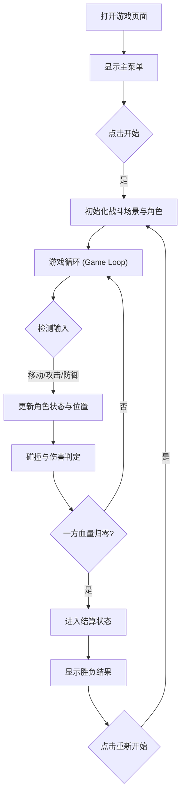

## 1. 产品概述
这是一款简单的像素风机甲对战网页小游戏。
- 主要提供复古像素美术风格的格斗对战体验，玩家可以控制一台机甲与另一台机甲（玩家2或简单AI）进行对战。
- 游戏包含基础的移动、攻击、防御以及简单的血量与胜负机制。

## 2. 核心功能

### 2.1 用户角色
| 角色 | 操作方式 | 核心权限 |
|------|----------|----------|
| 玩家 1 | 键盘 WASD 移动，J 攻击，K 防御 | 控制左侧机甲，进行对战 |
| 玩家 2 | 键盘 方向键 移动，1 攻击，2 防御 | 控制右侧机甲，进行对战 |

### 2.2 功能模块
1. **主菜单界面**: 包含游戏标题、开始对战按钮、操作说明。
2. **战斗场景**: 渲染像素风战斗背景，双方机甲精灵图，实时显示血量条 (HP)、计时器。
3. **游戏控制与物理引擎**: 实现角色移动、跳跃、AABB盒碰撞检测（攻击判定）、防御减伤逻辑。
4. **结算界面**: 显示胜负结果（如 "PLAYER 1 WINS!"），并提供重新开始功能。

### 2.3 页面详情
| 页面名称 | 模块名称 | 功能描述 |
|----------|----------|----------|
| 主页面 | 游戏画布 | 核心 Canvas 区域，负责渲染所有的菜单、场景和角色 |
| UI 叠加层 | 状态栏 | 位于屏幕顶部，显示双方血条和倒计时 |
| UI 叠加层 | 弹窗信息 | 游戏结束时弹出的胜负横幅和重开按钮 |

## 3. 核心流程
用户进入游戏后的主要操作流转。

## 4. 用户界面设计

### 4.1 设计风格
- **主色调**: 霓虹/赛博朋克像素色调（深紫、品红、青蓝）或复古街机色调。
- **字体**: 粗体像素风英文字体 (如 'Press Start 2P' 或类似像素字体)。
- **UI 元素**: 粗边框方块，血量条为鲜艳的绿色/红色填充方块。
- **角色设计**: 像素风格的机甲，具备待机(Idle)、移动(Run)、攻击(Attack)、受伤(Take Hit)和死亡(Death)等基础动画帧。

### 4.2 页面设计概览
| 页面名称 | 模块名称 | UI 元素 |
|----------|----------|---------|
| 游戏界面 | 背景层 | 像素城市或工厂背景，暗色调以突出机甲 |
| 游戏界面 | 角色层 | 具有轮廓和阴影的像素机甲精灵 |
| 游戏界面 | UI层 | 顶部粗犷的红色血条，黄色高亮的玩家标识 |

### 4.3 响应式
- 优先支持桌面端浏览器（通过实体键盘输入）。
- 游戏画布 (Canvas) 在屏幕中居中显示，按照 16:9 比例自动缩放以适应视口。