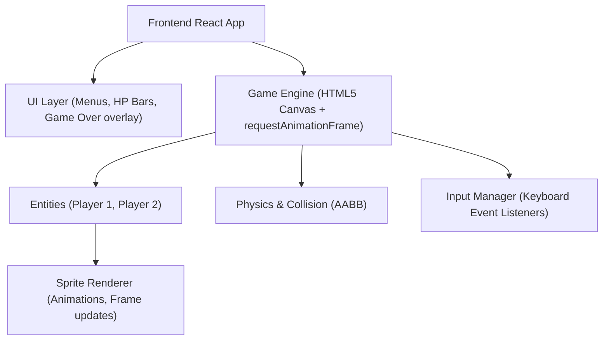

## 1. 架构设计

## 2. 技术说明

- **前端框架**: React@18 + tailwindcss@3 + Vite
- **游戏引擎**: 原生 HTML5 Canvas 结合 `window.requestAnimationFrame`。
- **状态管理**: 使用 React 状态管理 UI（主菜单、游戏结束面板、血量同步）。
- **组件结构**:
  - `App.tsx`: 主容器和路由状态。
  - `GameCanvas.tsx`: 核心渲染画布组件。
  - `HealthBar.tsx`: 位于顶部的像素风血条。
- **核心逻辑 (`/src/game/`)**:
  - `Fighter.ts`: 战斗实体类，处理物理、动画状态机和输入。
  - `Sprite.ts`: 基础精灵渲染类，处理切片动画。
  - `utils.ts`: 矩形碰撞检测函数。

## 3. 路由定义

本应用为单页面游戏体验，采用 React state 切换核心状态：
| 状态/视图 | 目标 |
|---------|---------|
| `MENU` | 显示主菜单、标题和操作说明 |
| `PLAYING` | 渲染 Canvas 和顶层 UI |
| `GAMEOVER` | 战斗结束，显示结算面板 |

## 4. API 定义

无后端 API 依赖，纯前端单机游戏。

## 5. 服务器架构图

无后端服务器，本项目直接由 Vite 构建为静态文件托管。

## 6. 数据模型

无持久化数据库需求。实体属性包含 `position (x,y)`、`velocity (x,y)`、`width`、`height`、`health`、`isAttacking`、`isDefending` 等内存状态。